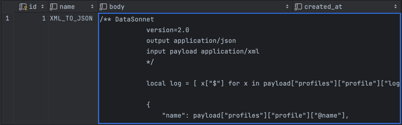

# ESB (Camel) + DataSonnet 
[](https://app.codacy.com/gh/VitaliyPivovarov/esb-datasonnet/dashboard?utm_source=gh&utm_medium=referral&utm_content=&utm_campaign=Badge_grade)

## Introduction
Assume that we receive some data and wish to translate it into a different format. 
If the structure of the received data changes, we wish to adjust the translation without compiling the application.

Let's say we receive some xml and want to convert it to json even if its structure may change at any time:

Input data:
```xml
<?xml version="1.0" encoding="UTF-8"?>
<profiles>
    <profile name="Test_user" time="2023-03-13 13:00:00">
        <logs>
            <p>login</p>
            <p>some process</p>
            <p>logout</p>
        </logs>
    </profile>
</profiles>
```
Output data:
```json
{
  "name": "Test_user",
  "time": "2023-03-13 13:00:00",
  "logs": [
    "login",
    "some process",
    "logout"
  ]
}
```

And for this case a bunch ESB + DataSonnet will help us.

ESB (Enterprise Service Bus) is a technology used for integrating various applications and services
in an enterprise environment. In Java, ESB technologies are implemented using different frameworks and libraries.

**[Apache Camel](https://camel.apache.org/)** is a popular open-source framework for implementing ESB patterns.
It provides a simple and easy-to-use API for routing, mediation, and transformation of messages between
different systems. Camel supports a wide range of protocols and data formats, making it suitable for integrating
diverse systems.

**[Datasonnet](https://datasonnet.github.io/datasonnet-mapper/datasonnet/latest/index.html)** is a data transformation language and tool that can be used with Camel to transform data between different formats.
Datasonnet provides a simple and intuitive way to transform data, and it can be used with various data sources and
targets.

## Step of realization

### Include dependencies
First, you'll need to include the necessary dependencies in your project. 
In your build.gradle file, add the following dependencies:
```text
    implementation 'org.apache.camel.springboot:camel-spring-boot-starter'
    implementation 'org.apache.camel.springboot:camel-activemq-starter'
    implementation 'org.apache.camel:camel-datasonnet'
```
### Define the routes

In Apache Camel, a route is a sequence of processing steps that messages pass through 
to get from a source to a destination. To define a route, you need to create a Java class that
extends the RouteBuilder class and override the configure() method. In this method, you can 
define the input and output endpoints, add processing steps, and specify any required configuration settings.

We employ the activemq approach in our case:
```java
@Service
public class InputRoute extends RouteBuilder {

    @Override
    public void configure() {

        from("activemq:queue:inputRoute")
                .routeId("inputRouteId")
                .to("activemq:queue:step");
    }
}
```

### Add processing steps
Next, create a Camel route that takes some input data, transforms it using DataSonnet, 
and sends it to an output destination. 

DataSonnet script converts input xml to json:
```text
/** DataSonnet
version=2.0
output application/json
input payload application/xml
*/

local log = [ x["$"] for x in payload["profiles"]["profile"]["logs"]["p"] ];

{
    "name": payload["profiles"]["profile"]["@name"],
    "time": payload["profiles"]["profile"]["@time"],
    "logs": log
}
```

And write this script to table `script`:



Route:
```java
@Service
@RequiredArgsConstructor
public class StepRoute extends RouteBuilder {

    private final ScriptRepository scriptRepository;
    private ScriptDomain scriptDomain;

    @PostConstruct
    public void init() {
        scriptDomain = scriptRepository.getByName("XML_TO_JSON");
    }

    @Override
    public void configure() {

        from("activemq:queue:step")
                .routeId("stepRouteId")
                .process(message -> {
                    Mapper mapper = new Mapper(scriptDomain.getBody());
                    String transformed = mapper.transform(message.getMessage().getBody(String.class));
                    message.getMessage().setBody(transformed);
                })
                .to("activemq:queue:endpoint");

    }
```

### Specify the endpoints
Endpoints are the source and destination of messages in a route. Apache Camel supports a wide range of endpoints, 
including file systems, databases, web services, message brokers, and more. To specify an endpoint, 
you can use the URI syntax supported by Apache Camel, which provides a simple and flexible way to 
specify the endpoint address, transport protocol, and other parameters.

```java
@Service
@Slf4j
@RequiredArgsConstructor
public class EndpointRoute extends RouteBuilder {

    @Override
    @Transactional
    public void configure() {

        from("activemq:queue:endpoint")
                .routeId("endpointRouteId")
                .process(value -> {
                    log.info(value.getMessage().getBody().toString());
                    //some process
                })
                .end();
    }
```

## Send message to MQ queue
Send the XML message to the MQ: 


And receive the log in the console: 

```text
{"name":"Test_user","time":"2023-03-13 13:00:00","logs":["login","some process","logout"]}
```

## Conclusion

When using Camel with Datasonnet, you can define data transformation rules using Datasonnet, and then use Camel to route
the transformed data between different systems and applications. Camel provides various components and tools for working
with Datasonnet, making it easy to integrate with other systems and applications.

Overall, using Camel with Datasonnet can provide a powerful and flexible integration solution that can handle various
data formats and communication protocols.

Thanks for reading!
